## Follow below steps to set up the Infrastructure on AWS to deply the application.
This guide covers everything you need to set up the infrastructure and tools **before** implementing the CI/CD pipeline. For the actual pipeline creation and deployment steps, see [README-implementation.md](./README-Implementation.md).

## Tech stack used in this project:
- GitHub (Code)
- Docker (Containerization)
- Jenkins (CI)
- OWASP (Dependency check)
- SonarQube (Quality)
- Trivy (Filesystem Scan)
- ArgoCD (CD)
- Redis (Caching)
- AWS EKS (Kubernetes)
- Helm (Monitoring using grafana and prometheus)

#
> [!Important]
> Below table helps you to navigate to the particular tool installation section fast.

| Tech stack    | Installation |
| -------- | ------- |
| Jenkins Master | <a href="#Jenkins">Install and configure Jenkins</a>     |
| eksctl | <a href="#EKS">Install eksctl</a>     |
| Argocd | <a href="#Argo">Install and configure ArgoCD</a>     |
| Jenkins-Worker Setup | <a href="#Jenkins-worker">Install and configure Jenkins Worker Node</a>     |
| Docker (Worker) | <a href="#docker">Install Docker on Jenkins Worker</a>     |
| SonarQube | <a href="#Sonar">Install and configure SonarQube</a>     |
| Trivy | <a href="#Trivy">Install Trivy</a>     |
| Email Notification Setup | <a href="#Mail">Email notification setup</a>     |
| Monitoring | <a href="#Monitor">Prometheus and grafana setup using helm charts</a>
| Clean Up | <a href="#Clean">Clean up</a>     |
#

### Pre-requisites to implement this project:
#

> [!Note]
> This project is implemented on Asia pecific mumbai region (ap-south-1). (you can implement on your prefered region)

- <b>Create 1 Master machine on AWS with 2CPU, 8GB of RAM (m7i-flex.large) and 29 GB of storage and install Docker on it.</b>
#
- <b>Open the below ports in security group of master machine and also attach same security group to Jenkins worker node (We will create worker node shortly)</b>


> [!Note]
> Opening of the below ports may cause securiy issue. Open the ports Just for lerning purpose and to avoid repeated inbound rule editing step while implementing project. Not prefered in Production Environment.

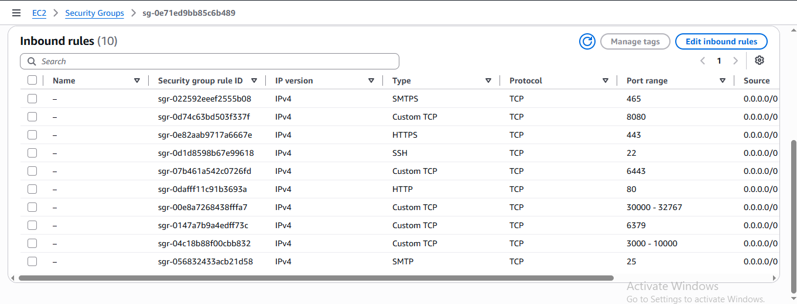

> [!Note]
> We are creating this master machine because we will configure Jenkins master, eksctl, EKS cluster creation from here.
> Make sure to check official documentation of respective softwares to download the latest version to avoid the errors.

Install & Configure Docker by using below command, "NewGrp docker" will refresh the group config hence no need to restart the EC2 machine.

```bash
sudo apt-get update
```
```bash
sudo apt-get install docker.io -y
sudo usermod -aG docker ubuntu && newgrp docker
```
#
- <b id="Jenkins">Install and configure Jenkins (Master machine)</b>
```bash
sudo apt update -y
sudo apt install -y openjdk-21-jre
java -version

sudo mkdir -p /etc/apt/keyrings
sudo wget -O /etc/apt/keyrings/jenkins-keyring.asc \
  https://pkg.jenkins.io/debian-stable/jenkins.io-2026.key

  
echo "deb [signed-by=/etc/apt/keyrings/jenkins-keyring.asc]" \
  https://pkg.jenkins.io/debian-stable binary/ | sudo tee \
  /etc/apt/sources.list.d/jenkins.list > /dev/null
  
sudo apt-get update -y
sudo apt-get install jenkins -y

# Start and enable Jenkins
sudo systemctl enable jenkins
sudo systemctl start jenkins

# Check status
sudo systemctl status jenkins

```
- <b>Now, access Jenkins Master on the browser on port 8080 and configure it</b>.
#
- <b id="EKS">Create EKS Cluster on AWS (Master machine)</b>
  - IAM user with **access keys and secret access keys**
  - AWSCLI should be configured (<a href="https://github.com/DevMadhup/DevOps-Tools-Installations/blob/main/AWSCLI/AWSCLI.sh">Setup AWSCLI</a>)
  ```bash
  curl "https://awscli.amazonaws.com/awscli-exe-linux-x86_64.zip" -o "awscliv2.zip"
  sudo apt install unzip
  unzip awscliv2.zip
  sudo ./aws/install
  aws configure
  ```

  - Install **kubectl** (Master machine)(<a href="https://github.com/DevMadhup/DevOps-Tools-Installations/blob/main/Kubectl/Kubectl.sh">Setup kubectl </a>)
  ```bash
  curl -o kubectl https://amazon-eks.s3.us-west-2.amazonaws.com/1.19.6/2021-01-05/bin/linux/amd64/kubectl
  chmod +x ./kubectl
  sudo mv ./kubectl /usr/local/bin
  kubectl version --short --client
  ```

  - Install **eksctl** (Master machine) (<a href="https://github.com/DevMadhup/DevOps-Tools-Installations/blob/main/eksctl%20/eksctl.sh">Setup eksctl</a>)
  ```bash
  curl --silent --location "https://github.com/weaveworks/eksctl/releases/latest/download/eksctl_$(uname -s)_amd64.tar.gz" | tar xz -C /tmp
  sudo mv /tmp/eksctl /usr/local/bin
  eksctl version
  ```
  
  - <b>Create EKS Cluster (Master machine)</b>
  ```bash
  eksctl create cluster --name=wanderlust \
                      --region=ap-south-1 \
                      --version=1.30 \
                      --without-nodegroup
  ```
  - <b>Associate IAM OIDC Provider (Master machine)</b>
  ```bash
  eksctl utils associate-iam-oidc-provider \
    --region ap-south-1 \
    --cluster wanderlust \
    --approve
  ```
  - <b>Create Nodegroup (Master machine)</b>
  ```bash
  eksctl create nodegroup --cluster=wanderlust \
                       --region=ap-south-1 \
                       --name=wanderlust \
                       --node-type=m7i-flex.large \
                       --nodes=2 \
                       --nodes-min=2 \
                       --nodes-max=2 \
                       --node-volume-size=29 \
                       --ssh-access \
                       --ssh-public-key=eks-nodegroup-key 
  ```
> [!Note]
>  Make sure the ssh-public-key "eks-nodegroup-key is available in your aws account"
#
- <b id="Jenkins-worker">Setting up jenkins worker node</b>
  - Create a new EC2 instance (Jenkins Worker) with 2CPU, 8GB of RAM (m7i-flex.large) and 29 GB of storage and install java on it
  ```bash
  sudo apt update -y
  sudo apt install -y openjdk-21-jre -y
  ```
  - Create an IAM role with <mark>administrator access</mark> attach it to the jenkins worker node <mark>Select Jenkins worker node EC2 instance --> Actions --> Security --> Modify IAM role</mark>


  - Configure AWSCLI (<a href="https://github.com/DevMadhup/DevOps-Tools-Installations/blob/main/AWSCLI/AWSCLI.sh">Setup AWSCLI</a>)
  ```bash
  sudo su
  ```
  ```bash
  curl "https://awscli.amazonaws.com/awscli-exe-linux-x86_64.zip" -o "awscliv2.zip"
  sudo apt install unzip
  unzip awscliv2.zip
  sudo ./aws/install
  aws configure
  ```
#
  - <b>generate ssh keys (Master machine) to setup jenkins master-slave</b>
  ```bash
  ssh-keygen
  ```
#
  - <b>Now move to directory where your ssh keys are generated and copy the content of public key and paste to authorized_keys file of the Jenkins worker node.</b>
#
  - <b>Now, go to the jenkins master and navigate to <mark>Manage jenkins --> Nodes</mark>, and click on Add node </b>
    - <b>name:</b> Node
    - <b>type:</b> permanent agent
    - <b>Number of executors:</b> 2
    - Remote root directory
    - <b>Labels:</b> Node
    - <b>Usage:</b> Only build jobs with label expressions matching this node
    - <b>Launch method:</b> Via ssh
    - <b>Host:</b> \<public-ip-worker-jenkins\>
    - <b>Credentials:</b> <mark>Add --> Kind: ssh username with private key --> ID: Worker --> Description: Worker --> Username: root --> Private key: Enter directly --> Add Private key</mark>
    - <b>Host Key Verification Strategy:</b> Non verifying Verification Strategy
    - <b>Availability:</b> Keep this agent online as much as possible
#
  - And your jenkins worker node is added

# 
- <b id="docker">Install docker (Jenkins Worker)</b>

```bash
sudo apt install docker.io -y
sudo usermod -aG docker ubuntu && newgrp docker
```
#
- <b id="Sonar">Install and configure SonarQube (Master machine)</b>
```bash
docker run -itd --name SonarQube-Server -p 9000:9000 sonarqube:lts-community
```
#
- <b id="Trivy">Install Trivy (Jenkins Worker)</b>
```bash
sudo apt-get install wget apt-transport-https gnupg lsb-release -y

wget -qO - https://aquasecurity.github.io/trivy-repo/deb/public.key | gpg --dearmor | sudo tee /usr/share/keyrings/trivy.gpg > /dev/null

echo "deb [signed-by=/usr/share/keyrings/trivy.gpg] https://aquasecurity.github.io/trivy-repo/deb $(lsb_release -sc) main" | sudo tee /etc/apt/sources.list.d/trivy.list

sudo apt-get update -y
sudo apt-get install trivy -y

trivy --version
```
#
- <b id="Argo">Install and Configure ArgoCD (Master Machine)</b>
  - <b>Create argocd namespace</b>
  ```bash
  kubectl create namespace argocd
  ```
  - <b>Apply argocd manifest</b>
  ```bash
  kubectl apply -n argocd -f https://raw.githubusercontent.com/argoproj/argo-cd/stable/manifests/install.yaml
  ```
  - <b>Make sure all pods are running in argocd namespace</b>
  ```bash
  watch kubectl get pods -n argocd
  ```
  - <b>Install argocd CLI</b>
  ```bash
  sudo curl --silent --location -o /usr/local/bin/argocd https://github.com/argoproj/argo-cd/releases/download/v2.4.7/argocd-linux-amd64
  ```
  - <b>Provide executable permission</b>
  ```bash
  sudo chmod +x /usr/local/bin/argocd
  ```
  - <b>Check argocd services</b>
  ```bash
  kubectl get svc -n argocd
  ```
  - <b>Change argocd server's service from ClusterIP to NodePort</b>
  ```bash
  kubectl patch svc argocd-server -n argocd -p '{"spec": {"type": "NodePort"}}'
  ```
  - <b>Confirm service is patched or not</b>
  ```bash
  kubectl get svc -n argocd
  ```
  - <b> Check the port where ArgoCD server is running and expose it on security groups of a worker node</b>

  

  - <b>Access it on browser, click on advance and proceed with</b>
  ```bash
  <public-ip-EKS cluster worker node>:<port>
  ```
  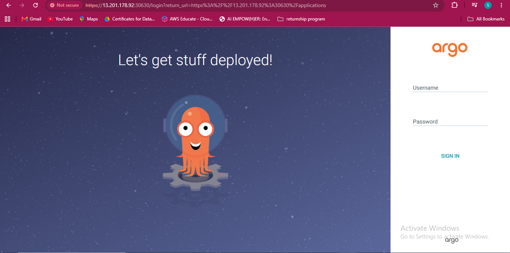
  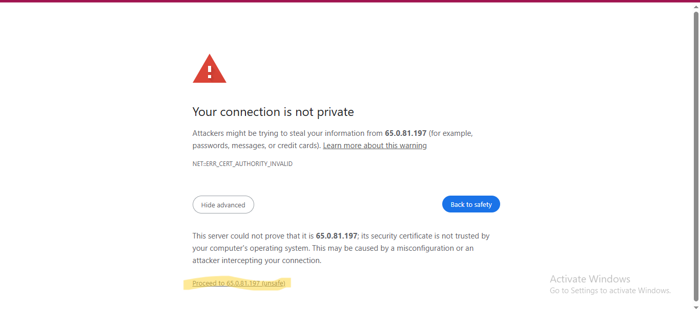
  
  - <b>Fetch the initial password of argocd server</b>
  ```bash
  kubectl -n argocd get secret argocd-initial-admin-secret -o jsonpath="{.data.password}" | base64 -d; echo
  ```
  - <b>Username: admin</b>
  - <b> Now, go to <mark>User Info</mark> and update your argocd password

  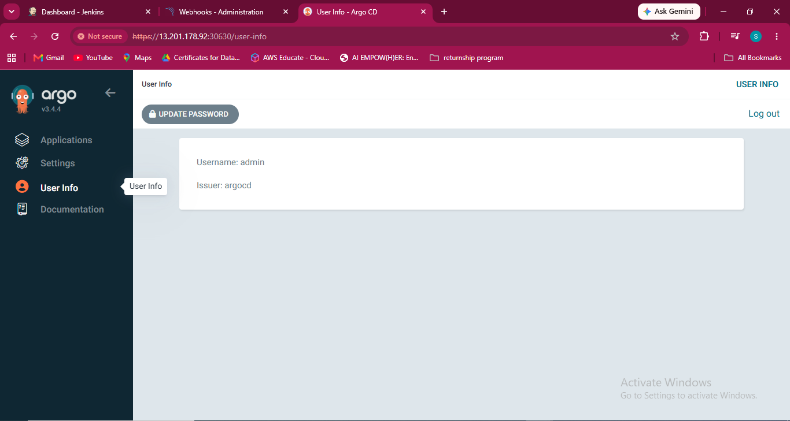
  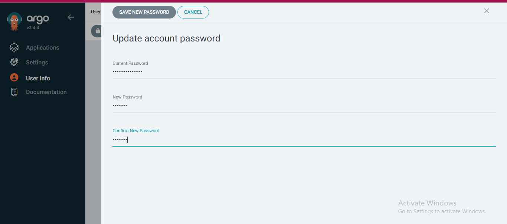
#
## Steps to add email notification
- <b id="Mail">Go to your Jenkins Master EC2 instance and allow 465 port number for SMTPS</b>
#
- <b>Now, we need to generate an application password from our gmail account to authenticate with jenkins</b>
  - <b>Open gmail and go to <mark>Manage your Google Account --> Security</mark></b>
> [!Important]
> Make sure 2 step verification must be on

  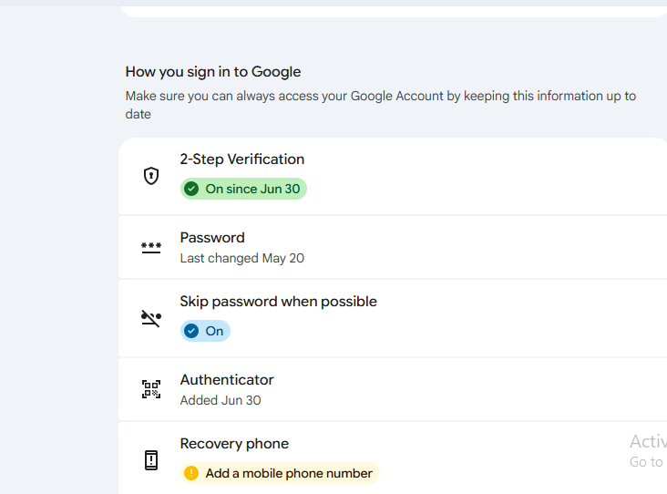

  - <b>Search for <mark>App password</mark> and create a app password for jenkins</b>
  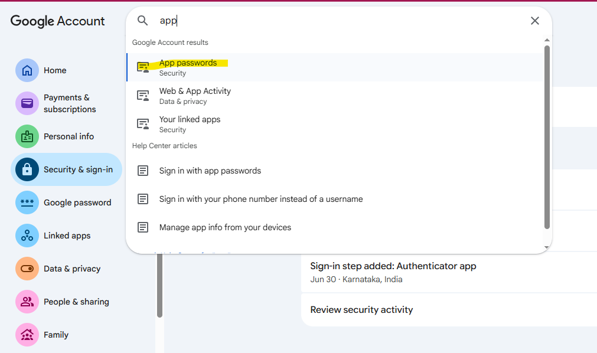
  
  
#
- <b> Once, app password is create and go back to jenkins <mark>Manage Jenkins --> Credentials</mark> to add username and password for email notification</b>

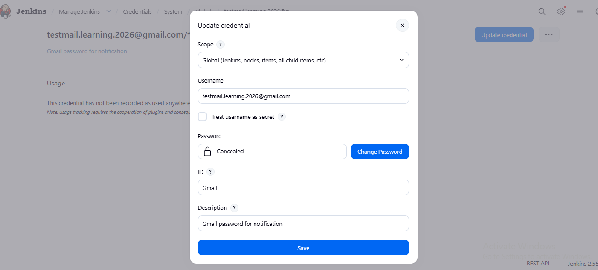

# 
- <b> Go back to <mark>Manage Jenkins --> System</mark> and search for <mark>Extended E-mail Notification</mark></b>

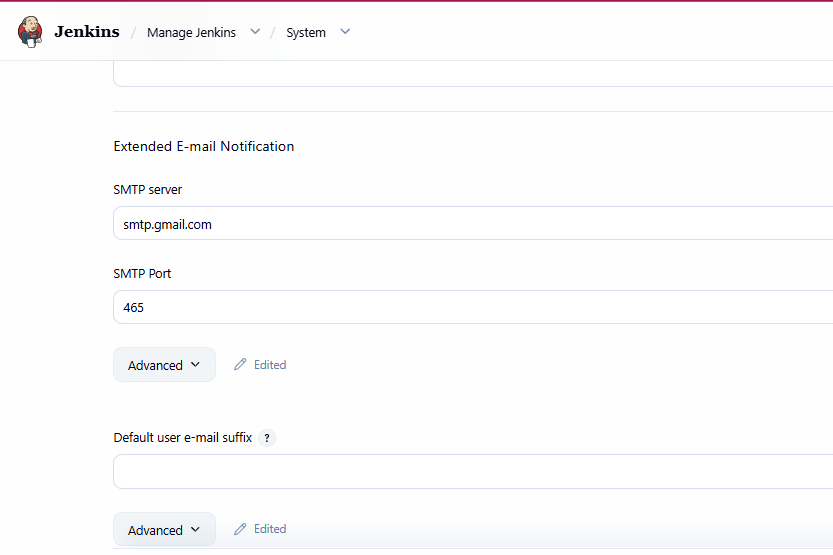
#
- <b>Scroll down and search for <mark>E-mail Notification</mark> and setup email notification</b>
> [!Important]
> Enter your gmail password which we copied recently in password field <mark>E-mail Notification --> Advance</mark>

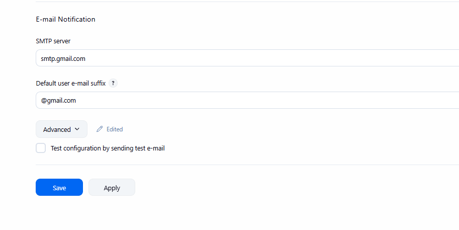
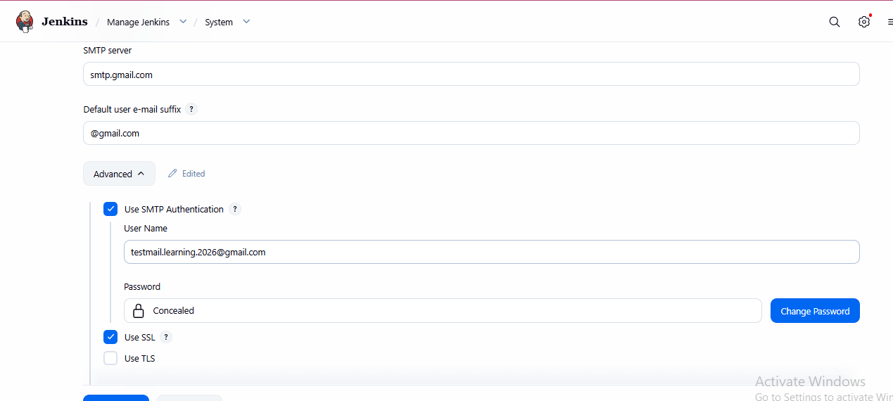

#
## How to monitor EKS cluster, kubernetes components and workloads using prometheus and grafana via HELM (On Master machine)
- <p id="Monitor">Install Helm Chart</p>
```bash
curl -fsSL -o get_helm.sh https://raw.githubusercontent.com/helm/helm/main/scripts/get-helm-3
```
```bash
chmod 700 get_helm.sh
```
```bash
./get_helm.sh
```

#
-  Add Helm Stable Charts for Your Local Client
```bash
helm repo add stable https://charts.helm.sh/stable
```

#
- Add Prometheus Helm Repository
```bash
helm repo add prometheus-community https://prometheus-community.github.io/helm-charts
```

#
- Create Prometheus Namespace
```bash
kubectl create namespace prometheus
```
```bash
kubectl get ns
```

#
- Install Prometheus using Helm
```bash
helm install stable prometheus-community/kube-prometheus-stack -n prometheus
```

#
- Verify prometheus installation
```bash
kubectl get pods -n prometheus
```

#
- Check the services file (svc) of the Prometheus
```bash
kubectl get svc -n prometheus
```

#
- Expose Prometheus and Grafana to the external world through Node Port
> [!Important]
> change it from Cluster IP to NodePort after changing make sure you save the file and open the assigned nodeport to the service.

```bash
kubectl edit svc stable-kube-prometheus-sta-prometheus -n prometheus
```
#
- Verify service
```bash
kubectl get svc -n prometheus
```

#
- Now,let's change the SVC file of the Grafana and expose it to the outer world
```bash
kubectl edit svc stable-grafana -n prometheus
```

#
- Check grafana service
```bash
kubectl get svc -n prometheus
```
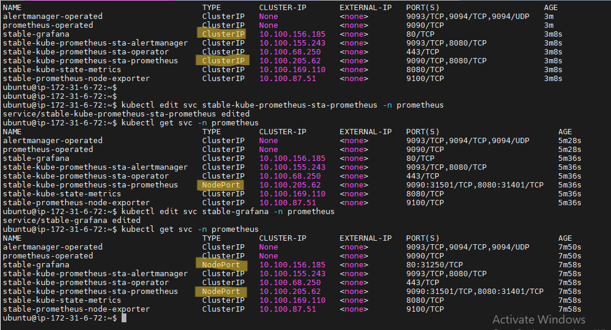

#
- Get a password for grafana
```bash
kubectl get secret --namespace prometheus stable-grafana -o jsonpath="{.data.admin-password}" | base64 --decode ; echo
```
> [!Note]
> Username: admin

#
- Now, view the  Grafana
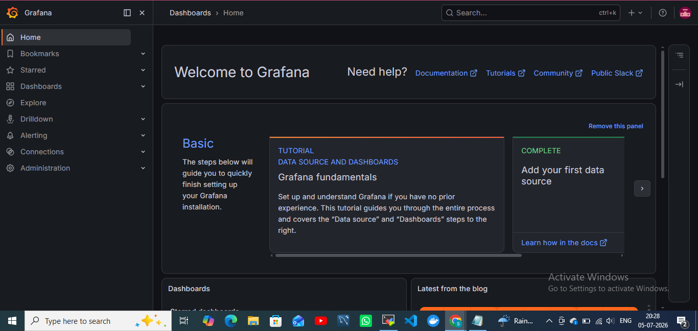

#

➡️ Once setup is complete, head over to [README-Implementation.md](./README-implementation.md) to build and run the CI/CD pipeline.
